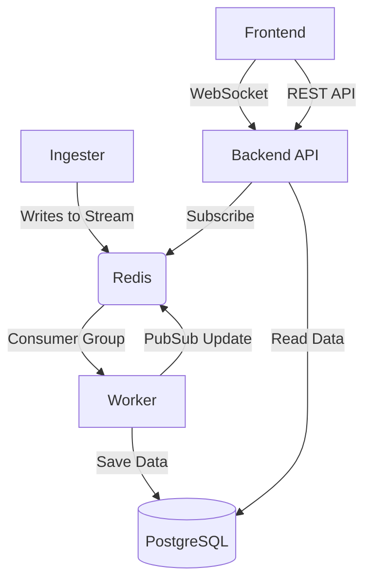

# System Architecture

## 1. System Diagram

The system follows an Event-Driven Microservices Architecture composed of 6 containerized services:

1.  **Ingester Service**: Simulates social media data streams (Twitter/Reddit) and publishes to Redis Streams.
2.  **Redis (Message Broker)**:
    - **Streams**: Buffers high-velocity ingestion data using Consumer Groups.
    - **Pub/Sub**: Broadcasts real-time events to the frontend.
3.  **Worker Service**: The AI brain. Consumes from Redis, processes text using Hugging Face Transformers (DistilBERT/RoBERTa), and saves to Postgres.
4.  **Database (PostgreSQL)**: Persistent storage for posts, analysis results, and alerts.
5.  **Backend API (FastAPI)**: Serves REST endpoints and manages WebSocket connections.
6.  **Frontend (React/Vite)**: Real-time visualization dashboard using WebSockets.

## 2. Data Flow Pipeline

1.  **Ingestion**: `Ingester` generates a post -> Publishes to Redis Stream `social_posts_stream`.
2.  **Processing**: `Worker` reads from Stream -> Runs AI Models -> Detects Sentiment & Emotion.
3.  **Storage**: Worker saves result to `PostgreSQL` tables (`social_media_posts`, `sentiment_analysis`).
4.  **Real-Time Push**: Worker publishes event to Redis Channel `sentiment_updates` -> Backend forwards to WebSockets.
5.  **Alerting**: Backend runs background task -> Checks database aggregates -> Triggers `SentimentAlert` if negative ratio > 0.5.

## 3. Technology Choices

- **FastAPI**: Chosen for native async support and automatic documentation.
- **Redis Streams**: Selected for at-least-once delivery guarantees via Consumer Groups.
- **PostgreSQL**: Required for complex relational queries and time-series aggregation (`date_trunc`).
- **Hugging Face**: Local inference avoids external API costs and latency.

